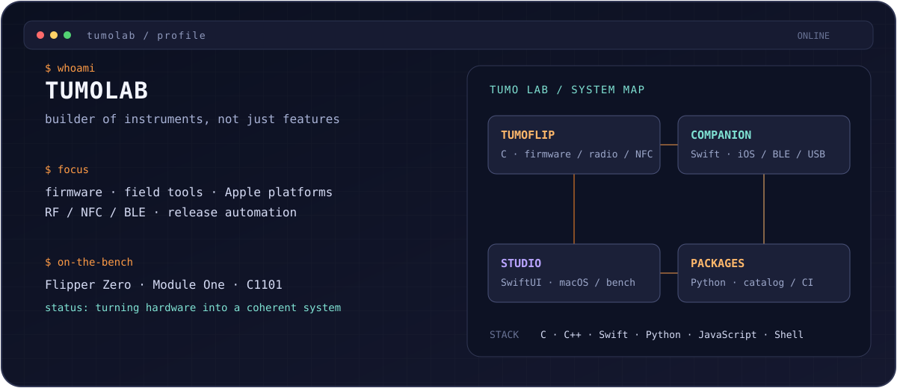

<!-- Profile README for github.com/squazaryu -->

<div align="center">
  
</div>

<h1 align="center">TumoLab</h1>

<p align="center">
  <strong>Firmware, field tools, and the software around them.</strong><br>
  Flipper Zero · RF / NFC · iPhone / macOS · release automation
</p>

> I work at the seam between a physical device and the person using it: the
> firmware on the Flipper, the companion app on the phone, the macOS bench, and
> the package pipeline that makes updates trustworthy.

## My workbench

| Layer | What I actually build |
| --- | --- |
| **Hardware** | Flipper Zero, Module One, C1101 and small embedded controllers |
| **Protocols** | NFC, Sub-GHz, BLE, USB and the edge cases between them |
| **Apple tools** | Native iOS and macOS apps for control, files, diagnostics and field work |
| **Operations** | Independent packages, protected-app audits, reproducible releases and routing failsafes |

## Stack

```text
SYSTEMS       C · C++ · CMake · Make
APPLE         Swift · SwiftUI · native iOS/macOS
AUTOMATION    Python · Shell · jq
DEVICE I/O    JavaScript · TypeScript · BLE · USB
```

## Core systems

- **[Tumoflip](https://github.com/squazaryu/tumoflip)** — my independent
  Flipper Zero firmware: custom desktop, ARF / ProtoPirate, NFC, Sub-GHz,
  Module One and the BLE App Bridge.
- **[TumoCompanion](https://github.com/squazaryu/TumoCompanion)** — the iPhone
  control room for firmware, FAPs, files, screen control and field workflows.
- **[Tumoflip Studio](https://github.com/squazaryu/tumoflip-studio)** — the
  macOS workbench for Flipper Zero, Tumoflip and Module One.
- **[FW Packages](https://github.com/squazaryu/tumoflip-fw-packages)** — an
  independent package catalog with immutable releases and protected-app audit
  lineage.

## Other things I keep running

[t-vgm-fw](https://github.com/squazaryu/t-vgm-fw) ·
[Disk Ray](https://github.com/squazaryu/DiskRay-app) ·
[FlipperRelay](https://github.com/squazaryu/flipper_relay) ·
[Shadowrocket configs](https://github.com/squazaryu/sr-config) ·
[rf-macro-sim](https://github.com/squazaryu/rf-macro-sim)

## My bias

- A device should behave like its UI says it will.
- A package should be independently verifiable, not tied to a convenient label.
- A green CI run is useful; a real device test is the final word.

<p align="center">
  <sub>From raw signal to verified release — one small, stubborn system at a time.</sub>
</p>
